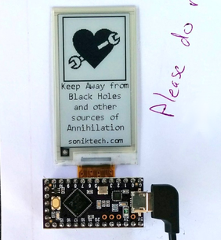
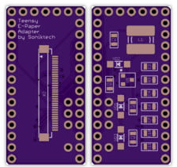

# TeensyEpaperShield
Teensy shield designed by [Jarek Lupinski](https://hackaday.io/Jarek) to connect e-paper display from [Pervasive Displays](http://www.pervasivedisplays.com/products#iTC):
 > The Simplest Way To Start Playing With A Fascinating New Low-Power Screen!

## OSH Park Shared Project
* [Teensy e-Paper shield](https://oshpark.com/shared_projects/3KynIVn6)

## Blog posts
* [Teensy E-Paper shield](https://blog.oshpark.com/2016/08/27/teensy-e-paper-shield/)
* [Teensy E-Paper shield update](https://blog.oshpark.com/2016/09/07/teensy-e-paper-shield-update/)

## Hackaday.io project
* [Teensy E-Paper Adapter Board](https://hackaday.io/project/13327-teensy-e-paper-adapter-board)

## Design files
* [EpaperTeensyBoard.sch](https://cdn.hackaday.io/files/13327570182368/EpaperTeensyBoard.sch)
* [EpaperTeensyBoard.brd](https://cdn.hackaday.io/files/13327570182368/EpaperTeensyBoard.brd)

## Images
* [images dir](/images)

## Video
* [YouTube: Teensy E-Paper Shield](https://www.youtube.com/watch?v=xAe1GGP35UQ)

## Bill of Materials
* [Teensy 3.x](https://oshpark.com/teensy) or [Teensy LC](http://store.oshpark.com/products/teensy-lc)
* [Pervasive Displays 2.15" e-paper with ITC (E2215CS062)](http://www.digikey.com/product-detail/en/pervasive-displays/E2215CS062/E2215CS062-ND/5975949)
* [Hirose Electric Co Ltd FH34SRJ-34S-0.5SH FPC connector]( https://www.digikey.com/short/3hv1q0 )
* [Parts list exported from EAGLE](https://cdn.hackaday.io/files/13327570182368/EpaperTeensyBoardPartlist.txt)
* [Digi-Key shopping cart #1](http://www.digikey.com/short/3mhnrd)
* [Digi-Key shopping cart #2](http://www.digikey.com/short/3m9wq3)

